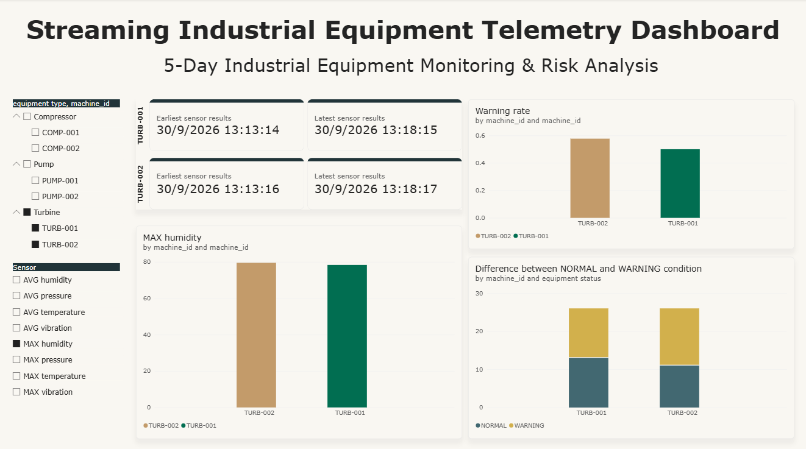

# 📊 Power BI Dashboard: Streaming Industrial Equipment Telemetry

> **5-Day Industrial Equipment Monitoring & Risk Analysis**

This folder contains the Power BI dashboard assets and visual reporting interface for the **Streaming Industrial Equipment Telemetry Pipeline**. The dashboard provides real-time operational monitoring, anomaly detection, and risk assessment across industrial machinery including Compressors, Pumps, and Turbines.

---

## 🖼️ Dashboard Preview

---

## 📈 Detailed Operational Analysis (Based on `Analysis.png`)

The current snapshot captures operational metrics filtered specifically for **Turbines** (`TURB-001` and `TURB-002`) focusing on **MAX Humidity** telemetry.

### 1. Telemetry Window & Equipment Timestamps
* **TURB-001**:
  * **Earliest Sensor Result**: `30/9/2026 13:13:14`
  * **Latest Sensor Result**: `30/9/2026 13:18:15`
  * **Active Window**: ~5 minutes of continuous telemetry.
* **TURB-002**:
  * **Earliest Sensor Result**: `30/9/2026 13:13:16`
  * **Latest Sensor Result**: `30/9/2026 13:18:17`
  * **Active Window**: ~5 minutes of continuous telemetry.

---

### 2. Metric Breakdown & Visual Insights

| Visual Title | Target Metric / Dimension | Observed Values & Findings | Key Insights & Business Impact |
| :--- | :--- | :--- | :--- |
| **MAX humidity by machine_id** | Maximum Humidity Level | • **TURB-002**: ~80% • **TURB-001**: ~79% | Both turbines operate at elevated humidity levels nearing 80%. `TURB-002` exhibits slightly higher peak moisture exposure. High humidity contributes to corrosion risks and blade degradation. |
| **Warning rate by machine_id** | Percentage of operational time spent in Warning state | • **TURB-002**: ~0.57 (57%) • **TURB-001**: ~0.50 (50%) | Over half of all streaming events for both turbines trigger warning conditions. `TURB-002` has a significantly higher risk profile with a 57% warning rate. |
| **Difference between NORMAL and WARNING condition** | Stacked Count of Status Events | • **TURB-001**: 13 Normal / 13 Warning (Total 26) • **TURB-002**: 11 Normal / 15 Warning (Total 26) | Out of 26 evaluated telemetry batches per machine, `TURB-002` registered 15 warning alerts vs. 11 normal states, indicating severe stability issues. |

---

### 3. Key Analytical Takeaways & Risk Summary
1. **Critical Warning Rates**: Both turbines exceed acceptable operational safety thresholds (warning rates of 50% and 57% respectively).
2. **Environmental Factor Correlation**: Peak MAX humidity values (~80%) strongly correlate with elevated warning occurrences, indicating that humidity management or moisture separation may require immediate engineering inspection.
3. **Asset Prioritization**: `TURB-002` is in higher distress than `TURB-001` across all metrics (higher peak humidity, higher warning rate, higher proportion of warning occurrences).

---

## 🕹️ How to Use the Dashboard Interactively

The Power BI dashboard is designed for interactive exploration, cross-filtering, and root-cause investigation.

### 1. Equipment Hierarchy Filtering (`equipment type, machine_id` Slicer)
* **Location**: Top-left navigation panel.
* **Function**: Filter the entire dashboard by machinery type and individual machine IDs.
* **How to Use**:
  * Click the expand arrow `v` next to `Compressor`, `Pump`, or `Turbine`.
  * Check/uncheck individual units (e.g., `COMP-001`, `PUMP-002`, `TURB-001`).
  * Hold **Ctrl + Click** to select multiple non-adjacent machines for cross-comparison.

### 2. Telemetry Sensor Selection (`Sensor` Slicer)
* **Location**: Bottom-left navigation panel.
* **Function**: Dynamically switch the primary metric displayed across the central bar chart.
* **Available Options**:
  * `AVG humidity`, `AVG pressure`, `AVG temperature`, `AVG vibration`
  * `MAX humidity`, `MAX pressure`, `MAX temperature`, `MAX vibration`
* **How to Use**: Select any single metric (e.g., `MAX temperature`). The middle visual will update its title, axis labels, and bar heights dynamically.

### 3. Cross-Filtering & Interactive Visual Connections
* **Bar Chart Selections**: Click on any bar (e.g., `TURB-002` in the Warning Rate chart). All other visuals (Humidity chart, Condition breakdown stacked bar) will highlight data associated with `TURB-002`.
* **Condition Isolation**: Click on the **WARNING** segment (yellow/gold) in the stacked bar chart to isolate and inspect sensor behaviors specifically when machines enter abnormal states.
* **Tooltip Inspection**: Hover over any chart element or stacked segment to view precise quantitative numbers, exact percentages, and underlying status details.

### 4. Timestamp Window Verification (KPI Cards)
* **Location**: Top-center region.
* **Function**: Monitor the active data ingestion range per machine.
* **How to Use**: Use these timestamps to verify data streaming continuity and detect potential pipeline latency or missing message intervals.

---

## 🛠️ Data Schema & Metric Formulas

* **Warning Rate**:
  $$\text{Warning Rate} = \frac{\text{Count of WARNING Status Readings}}{\text{Total Sensor Telemetry Readings}}$$
* **Condition Status**: Categorized into `NORMAL` or `WARNING` based on threshold rules configured in the Spark streaming aggregation pipeline.
