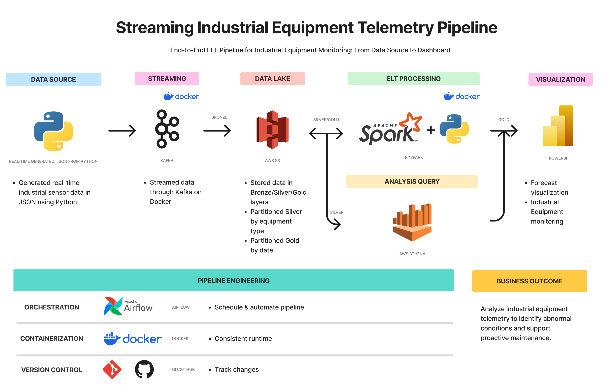

# Streaming Industrial Equipment Telemetry Pipeline

Streaming Industrial Equipment Telemetry Pipeline is an individual project for learning data engineering and building an end-to-end streaming data pipeline to collect, transform, and analyze real-time telemetry data from industrial equipment.

## Project Overview

This project builds a streaming telemetry data pipeline that:
- Simulates telemetry sensor data from industrial equipment (Turbine, Compressor, Pump) using Python and streams it via Apache Kafka on Docker
- Consumes streaming telemetry events and batches raw data into AWS S3 as raw JSON (Bronze layer)
- Transforms and cleans raw data using PySpark Structured Streaming on Docker to add equipment status indicators and partition by equipment type (Silver layer)
- Aggregates daily telemetry metrics and warning counts using PySpark and partitions by date (Gold layer)
- Stores structured Medallion Architecture datasets (Bronze, Silver, Gold) in AWS S3 cloud storage
- Enables SQL queries in AWS Athena for equipment health and anomaly analysis
- Prepares analytical data for interactive reporting in Power BI (In Progress)

## Tech Stack

- Python
- Apache Kafka
- PySpark (Apache Spark Structured Streaming)
- AWS S3
- AWS Athena
- Docker & Docker Compose
- Apache Airflow
- Power BI

## Prerequisites

- Python 3.12+
- Docker & Docker Compose
- AWS Account (S3 Bucket & IAM Access Keys with Athena access)
- Git
> I personally developed/tested on Python 3.14.6

## Setup

### 1. Clone the repository

```bash
    git clone https://github.com/MeldyRose/Streaming-Industrial-Equipment-Telemetry-Pipeline.git
    cd Streaming-Industrial-Equipment-Telemetry-Pipeline
```

### 2. Create a virtual environment

```bash
    python -m venv .venv
```

Activate it:

**Windows**
```bash
    .venv\Scripts\activate
```

### 3. Install dependencies

* **Docker (Recommended)**: Services and Spark containers run with dependencies pre-configured inside Docker containers.
* **Local Python Execution (Fallback)**: If running producer or consumer scripts manually outside Docker, install dependencies inside your virtual environment:

  ```bash
  pip install -r requirements.txt
  ```

### 4. Configure environment variables

Create a `.env` file by copying `.env.example`:

**Linux / macOS / Git Bash / PowerShell:**
```bash
cp .env.example .env
```

Or on **Windows Command Prompt (cmd)**:
```cmd
copy .env.example .env
```

Open `.env` and fill in your AWS credentials (`KEY_ID`, `SECRET_KEY`, `AWS_REGION`, `S3_BUCKET_NAME`) and database configuration.

> **Security Note:** Never commit your `.env` file or API keys to Git (`.env` is included in `.gitignore`).

### 5. Run the pipeline

The streaming telemetry pipeline consists of data generation, ingestion to S3, Spark streaming processing, and Athena SQL querying.

#### 5.1 Start Infrastructure with Docker

Start Kafka, PySpark, Airflow, and auxiliary services using Docker Compose:

```bash
docker compose up -d
```

#### 5.2 Simulate Telemetry Data Generation

Run the Python sensor simulator to produce real-time sensor events for industrial machines into the Kafka topic `machine-telemetry`:

```bash
python -m producer.sensor_simulator
```

#### 5.3 Ingest Raw Telemetry to AWS S3 (Bronze Layer)

Run the S3 consumer script to batch Kafka stream messages into raw JSON format and upload them to S3:

```bash
python -m consumer.s3
```

#### 5.4 Execute PySpark Streaming Jobs (Silver & Gold Layers)

Run the PySpark streaming applications using Docker:

1. **Silver Streaming Transformation**:
   Reads raw Bronze JSON from S3, parses schemas, flags equipment warnings (`WARNING` if temperature > 85°C or vibration > 5 mm/s), and writes Parquet files to `s3://<bucket>/silver/` partitioned by `equipment_type`.
   ```bash
   docker compose run spark-silver
   ```

2. **Gold Streaming Aggregation**:
   Reads Silver Parquet data from S3, applies 1-day window aggregations (calculating daily average/max temperature, vibration, pressure, total readings, and warning counts), and writes Parquet files to `s3://<bucket>/gold/` partitioned by `date`.
   ```bash
   docker compose run spark-gold
   ```

#### 5.5 Query Telemetry Data via AWS Athena (SQL)

1. **Create Table**: Execute `config/sql/create_database.sql` in AWS Athena to register the external table `silver_db.telemetry_data` referencing the Parquet data in `s3://<bucket>/silver/`.
2. **Run Analytical Queries**: Execute `config/sql/analysis_queries.sql` to run anomaly detection, machine metric averages, peak readings, and warning rate percentage queries.

## ELT Pipeline



```text
[ Sensor Simulator (Python) ] ──> [ Apache Kafka (Docker) ] ──> [ S3 Consumer (Python) ] ──> [ AWS S3 (Bronze JSON) ]
                                                                                                    │
                                                                                                    ▼
[ Power BI ] <── [ AWS Athena (SQL Queries) ] <── [ AWS S3 (Gold/Silver Parquet) ] <── [ PySpark Silver / Gold ]
(In Progress)   (config/sql/)                    (Partitioned Datasets)                 (Docker Containers)
```

## Project Structure
```
Streaming-Industrial-Equipment-Telemetry-Pipeline/
│
├── config/
│   ├── sql/
│   │   ├── analysis_queries.sql
│   │   └── create_database.sql
│   └── equipment_config.py
│
├── consumer/
│   └── s3.py
│
├── dags/
│
├── logs/
│
├── plugins/
│
├── producer/
│   ├── create_topic.py
│   ├── delete_topic.py
│   ├── sensor_simulator.py
│   ├── test_kafka.py
│   └── test_s3.py
│
├── spark/
│   ├── gold_stream.py
│   ├── silver_stream.py
│   └── test_spark.py
│
├── tests/
│
├── .env.example
├── .gitignore
├── docker-compose.yaml
├── LICENSE
├── README.md
└── requirements.txt
```

## Data Source

- Simulated Industrial Equipment Sensor Telemetry (Turbines, Compressors, Pumps) generating metrics for temperature, humidity, vibration, and pressure.

## Data Dictionary

The processed equipment telemetry data includes:

- `machine_id` = unique identifier for equipment (e.g. `TURB-001`, `COMP-001`, `PUMP-001`)
- `equipment_type` = machine classification (`Turbine`, `Compressor`, `Pump`)
- `timestamp` = ISO-8601 UTC event timestamp
- `temperature_c` = operating temperature in Celsius (°C)
- `humidity_percent` = relative humidity in percentage (%)
- `vibration_mm_s` = vibration velocity in millimeters per second (mm/s)
- `pressure_bar` = operational pressure in bar
- `equipment_status` = health/operational condition status
    - `NORMAL` = operational parameters within safe limits
    - `WARNING` = abnormal parameters detected (`temperature_c > 85` or `vibration_mm_s > 5`)

## Analysis

The telemetry data produced by the streaming pipeline is structured using a Medallion Architecture (Bronze -> Silver -> Gold) stored in AWS S3 and queried in AWS Athena:

- **Bronze Layer**: Raw JSON records ingested directly from Kafka streams.
- **Silver Layer**: Cleaned telemetry with timestamps and status condition flags (`NORMAL` / `WARNING`), partitioned by `equipment_type`.
- **Gold Layer**: Daily aggregated operational metrics (average/max temperature, vibration, pressure, and total warning counts), partitioned by `date`.

### Athena SQL Analytical Queries

The SQL scripts in `config/sql/` provide insights into machine operational health:

1. **Abnormal Sensor Conditions**: Counts warning/critical events per machine.
2. **Equipment Type Averages**: Calculates average temperature, humidity, vibration, and pressure grouped by machine.
3. **Peak Temperature**: Identifies machines with maximum temperature readings.
4. **Peak Humidity**: Identifies machines with maximum humidity readings.
5. **Peak Vibration**: Identifies machines with maximum vibration levels.
6. **Peak Pressure**: Identifies machines with maximum pressure readings.
7. **Abnormal Condition Rate**: Calculates warning rate percentage (`warning_count / total_readings * 100`) for each machine.

### Current Status (In Progress)

- [x] Python data generation simulating industrial equipment sensors streaming to Kafka on Docker.
- [x] Raw Bronze data ingested from Kafka and loaded into AWS S3 cloud storage.
- [x] PySpark streaming on Docker transforming Bronze data to Silver layer with partitioning by `equipment_type`.
- [x] PySpark streaming aggregating Silver data to Gold layer with partitioning by `date` and writing back to S3.
- [x] Created AWS Athena DDL table definition (`create_database.sql`) and 7 analytical queries (`analysis_queries.sql`) in `config/sql/`.
- [ ] Connect AWS Athena queries to Power BI for interactive dashboard reports (*In Progress*).

## Future Improvements

- Finalize Power BI dashboard visualizations connected to AWS Athena.
- Add data quality tests and assertions (e.g. Great Expectations / Pytest).
- Automate pipeline orchestration using Apache Airflow DAGs.
